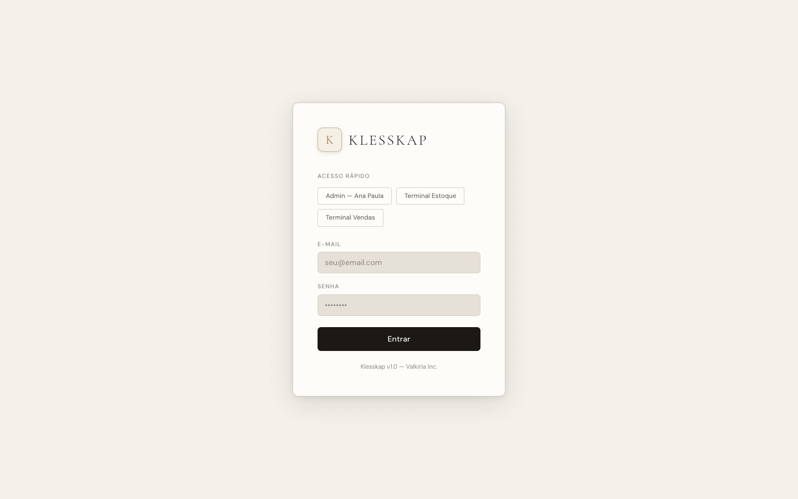
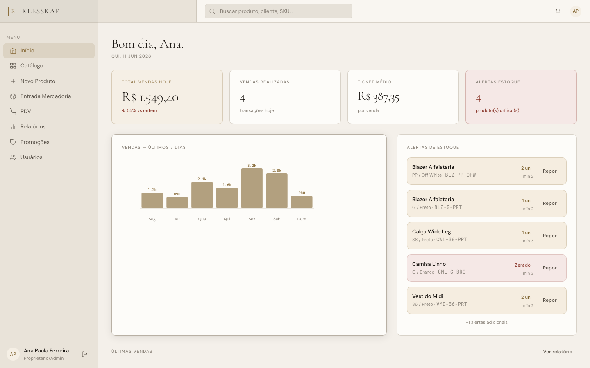
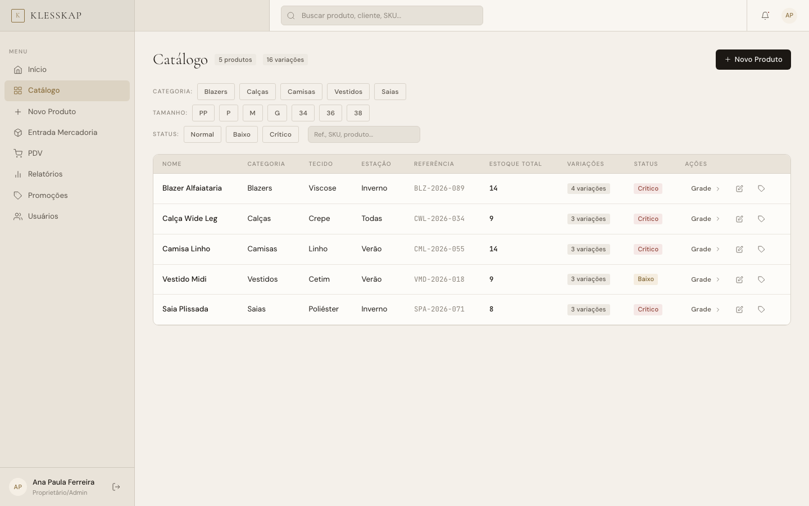
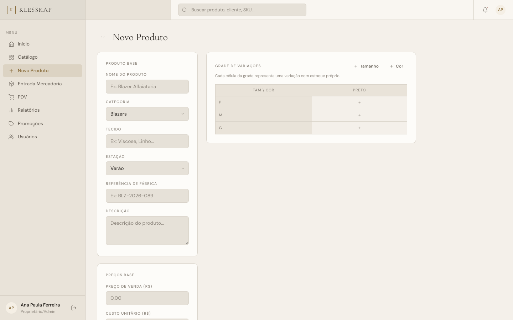
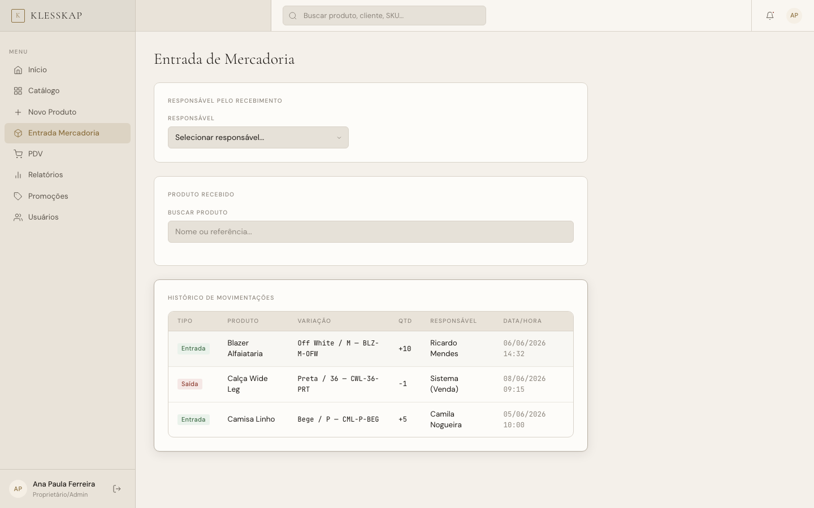
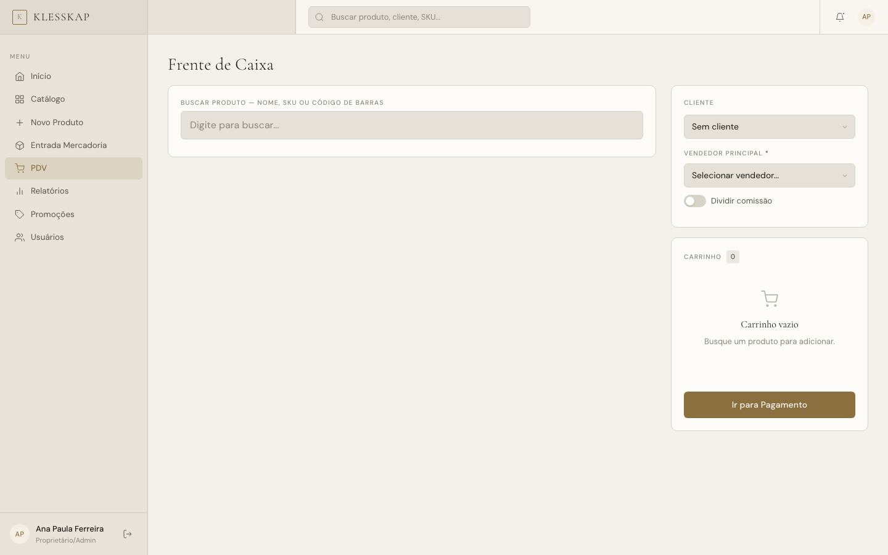
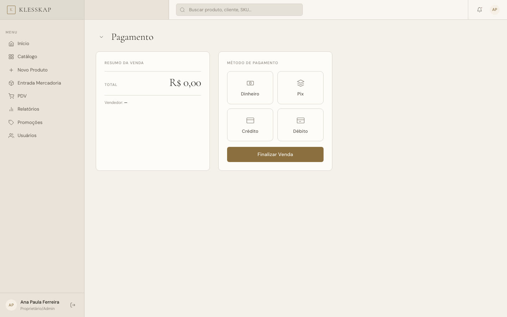
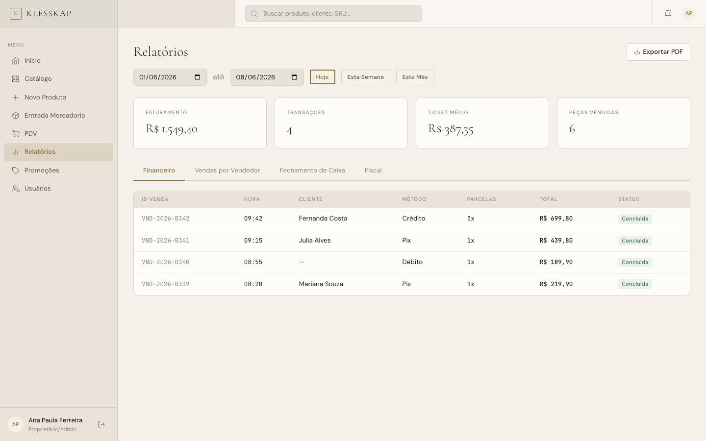
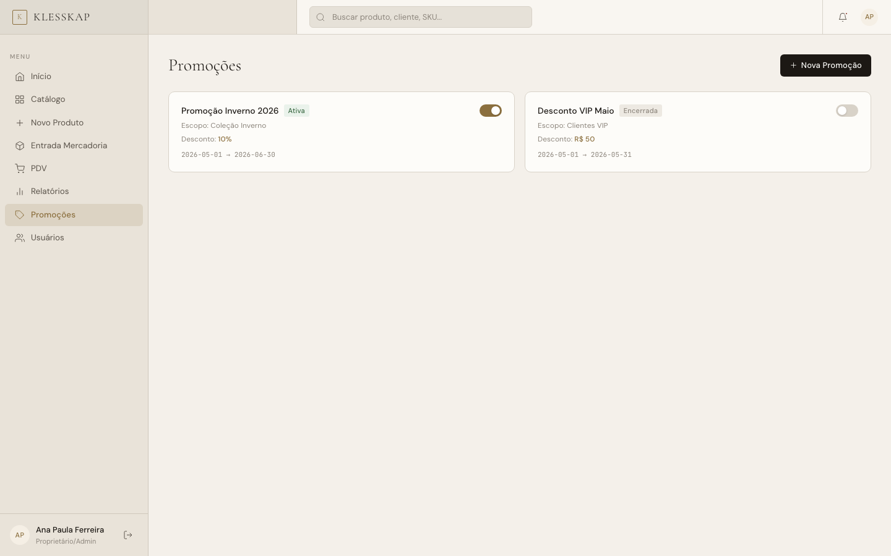
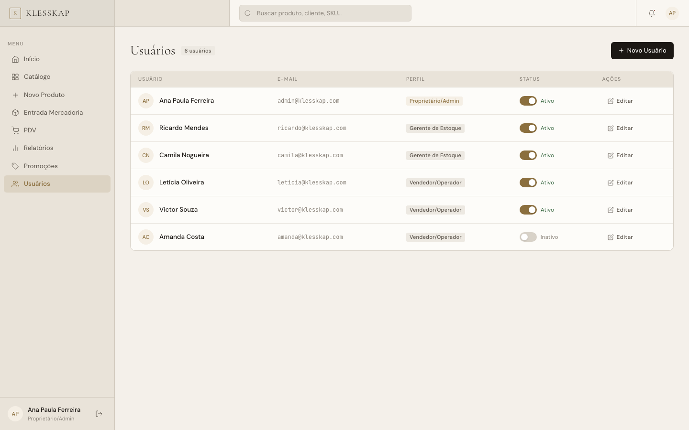

# KLESSKAP

> **Sistema de PDV e gestão de estoque para varejo de moda** — do norueguês *klesskap* (guarda-roupa): organização elegante de cada peça.

**Demo ao vivo:** https://klesskap-eight.vercel.app


---

## Sobre o projeto

Klesskap é um sistema web de ponto de venda (PDV) e controle de estoque desenvolvido para lojas de varejo de moda de pequeno e médio porte. O sistema centraliza em uma única interface as operações que costumam ser tratadas de forma fragmentada — planilhas para estoque, calculadora para troco, caderno para comissões — e oferece um fluxo coeso do recebimento de mercadoria até o fechamento de caixa.

O problema que o Klesskap resolve é concreto: lojas de moda lidam com um catálogo complexo por natureza, onde cada produto existe em múltiplas combinações de tamanho e cor. Controlar esse nível de granularidade manualmente é propenso a erros — venda de item sem estoque, divergência entre o que entrou e o que foi vendido, comissões calculadas de cabeça. O sistema trata cada variação (ex: Blazer Alfaiataria, Off White / M) como uma unidade independente, com SKU, código de barras, estoque mínimo e preço próprios.

O projeto foi construído como protótipo funcional para validação de fluxos operacionais. Todos os dados são simulados em memória — não há servidor nem banco de dados. O foco está na experiência de uso das três personas principais: a proprietária (que gerencia tudo), o responsável pelo estoque (recebimento e cadastro) e o operador de caixa (PDV e pagamento).

---

## Funcionalidades principais

### Dashboard
- Métricas do dia em tempo real: total de vendas, número de transações, ticket médio e alertas de estoque
- Gráfico de barras com o volume de vendas dos últimos 7 dias
- Painel de alertas de estoque mínimo com ação rápida de reposição
- Tabela das últimas vendas com vendedor, método de pagamento e status

### Catálogo de Produtos
- Listagem com filtros combinados por categoria, tamanho, status de estoque e busca por texto (nome, referência, SKU, código de barras)
- Expansão inline de grade de variações (tamanho × cor) diretamente na tabela
- Cada variação exibe: SKU, código de barras, estoque atual, estoque mínimo, preço e status
- Indicadores visuais de estoque crítico (zerado ou abaixo do mínimo) e estoque baixo

### Cadastro de Produto
- Formulário com campos de nome, categoria, tecido, estação, referência e descrição
- Grade interativa de variações: eixo tamanho × eixo cor, com ativação de célula por clique
- Geração automática de SKU a partir da referência, tamanho e cor
- Geração de código de barras (EAN-13 simulado) para cada variação
- Campos de preço de venda e custo unitário (visíveis apenas para perfis Admin e Estoque)

### Entrada de Mercadoria
- Busca de produto por nome ou referência para seleção do item recebido
- Entrada de quantidade por variação individual (cada combinação tamanho/cor separada)
- Seleção do responsável pelo recebimento (equipe de estoque cadastrada)
- Atualização do estoque e recálculo automático do status (normal / baixo / crítico)
- Histórico de movimentações com tipo (entrada/saída), variação, quantidade e data

### PDV — Frente de Caixa
- Busca de produto por nome, SKU ou código de barras
- Seleção de variação com picker visual (tamanho → cor), bloqueando automaticamente variações sem estoque
- Carrinho com controle de quantidade (respeita limite de estoque disponível) e remoção de itens
- Seleção de vendedor principal com opção de divisão de comissão entre dois vendedores
- Cálculo automático de comissão individual (3%) com exibição do rateio em tempo real
- Seleção de cliente para vinculação da venda

### Pagamentos
- Métodos disponíveis: Dinheiro, Pix, Cartão de Crédito e Cartão de Débito
- Parcelamento no crédito: 1×, 2×, 3×, 4×, 5×, 6×, 10× ou 12×, com exibição do valor por parcela
- Calculadora de troco para pagamentos em dinheiro
- Processamento simulado com feedback de progresso e emissão de recibo
- Recibo com detalhamento de itens, método, vendedor(es), comissão e ID da venda

### Relatórios
- **Financeiro:** listagem completa de vendas com ID, horário, cliente, método e total
- **Vendas por Vendedor:** volume e comissão por vendedor com divisão de vendas compartilhadas
- **Fechamento de Caixa:** total por método de pagamento (dinheiro, Pix, crédito, débito)
- **Fiscal:** nota/cupom com número, data, cliente e status de emissão
- Seletor de período (Hoje / Esta Semana / Este Mês) e intervalo por data

### Promoções
- Cadastro de promoções com nome, escopo, percentual ou valor de desconto e período de vigência
- Ativação e desativação por toggle diretamente na listagem

### Gestão de Usuários
- Tabela de usuários com nome, e-mail, perfil e status
- Ativação e desativação de usuários por toggle
- Proteção contra auto-desativação (um usuário não pode desativar a própria conta)

---

## Perfis de acesso

O sistema possui três perfis com visibilidades distintas. A navegação lateral é renderizada dinamicamente conforme o perfil autenticado.

| Perfil | Telas acessíveis | Dados sensíveis |
|---|---|---|
| **Proprietário / Admin** | Todas (Dashboard, Catálogo, Novo Produto, Entrada, PDV, Relatórios, Promoções, Usuários) | Custo unitário, margens, comissões, relatório financeiro completo |
| **Gerente de Estoque** | Dashboard, Catálogo, Novo Produto, Entrada de Mercadoria | Custo unitário e preço de venda |
| **Operador / Vendas** | Dashboard, PDV, Vendas do Dia | Preço de venda |

### Credenciais de demonstração

> ⚠️ Estas credenciais existem exclusivamente para fins de prototipação. Não representam dados reais e devem ser removidas antes de qualquer uso em produção.

| Perfil | E-mail | Senha |
|---|---|---|
| Proprietário / Admin | `admin@klesskap.com` | `admin123` |
| Terminal de Estoque | `estoque@klesskap.com` | `estoque123` |
| Terminal de Vendas | `vendas@klesskap.com` | `vendas123` |

A tela de login oferece chips de acesso rápido que preenchem as credenciais automaticamente, facilitando a navegação durante a demonstração.

---

## Stack técnica

O projeto é intencionalmente sem dependências de pacote ou etapa de build. Tudo roda diretamente no navegador.

| Camada | Tecnologia | Observação |
|---|---|---|
| Marcação | HTML5 semântico | Estrutura estática em `index.html` |
| Estilos base | CSS custom (`klesskap.css`) | Design tokens em variáveis CSS, componentes e animações |
| Utilitários | Tailwind CSS via CDN | Configuração inline no `<head>` com paleta e tipografia customizadas |
| Lógica | JavaScript vanilla ES6+ | `klesskap.js`, sem framework, sem módulos externos |
| Tipografia | Google Fonts | Cormorant Garamond (display), DM Sans (UI), JetBrains Mono (dados) |
| Ícones | SVG inline | Gerados via função `svgIcon()` em JavaScript, sem biblioteca externa |

**Sobre o `klesskap.css`:** o arquivo define um sistema de tokens completo em `:root` — paleta, sombras, easing curves, fontes — e implementa todos os componentes da interface (cards, tabelas, botões, inputs, badges, modal, toast, toggle, tabs, PDV, pagamento). O Tailwind serve apenas para utilitários de layout e espaçamento; os componentes com identidade visual são inteiramente definidos no CSS próprio.

---

## Estrutura do projeto

```
klesskap/
├── index.html        # Estrutura HTML completa — shell do app e tela de login
├── klesskap.css      # Sistema de design: tokens, layout, componentes, animações
├── klesskap.js       # Dados mock, estado global, lógica de negócio e renderização de todas as telas
├── PRODUCT.md        # Contexto de produto: propósito, usuários, princípios de design
├── DESIGN.md         # Sistema de design: paleta, tipografia, elevação, motion
└── README.md         # Este arquivo
```

### Responsabilidades de cada arquivo

**`index.html`** — Define o shell estático da aplicação: tela de login (com campos, chips de acesso rápido e mensagem de erro), estrutura do app (sidebar, header, zona de busca, zona de ações) e os containers de cada tela (`<section id="screen-*">`). O conteúdo de cada tela é injetado dinamicamente pelo JavaScript.

**`klesskap.css`** — Importa as fontes, define os tokens de design como variáveis CSS, e implementa todos os componentes: layout do app shell, navegação lateral, header, botões, inputs, badges, cards, tabelas, modal, toast, toggle, tabs, PDV (picker de variação, carrinho), pagamento e animações (`fade-in`, `fade-in-scale`, `toast-in`, `toast-out`, `expand-down`).

**`klesskap.js`** — Contém os dados mock (produtos, vendas, usuários, promoções), o estado global da aplicação (`appState`), os utilitários (formatação de moeda, data, cálculo de status) e todas as funções de renderização e lógica de negócio para cada módulo. Estruturado em três partes: dados/estado/nav/login, dashboard/catálogo/form/entrada, e PDV/pagamento/relatórios/promoções/usuários.

---

## Como executar

O Klesskap é um projeto completamente estático. Não requer servidor, instalação de dependências ou etapa de compilação.

### Abertura direta

```bash
# Clone o repositório
git clone <url-do-repositório>
cd klesskap

# Abra no navegador
open index.html          # macOS
xdg-open index.html      # Linux
start index.html         # Windows
```

Ou simplesmente arraste o arquivo `index.html` para uma janela do navegador.

### Via servidor local (opcional)

Se preferir servir via HTTP para evitar restrições de CORS em alguns navegadores:

```bash
# Com Python 3
python3 -m http.server 8080

# Com Node.js (npx)
npx serve .
```

Acesse `http://localhost:8080` no navegador.

### Compatibilidade

- Navegadores modernos: Chrome 90+, Firefox 88+, Safari 14+, Edge 90+
- Requer JavaScript habilitado
- Requer acesso à internet para carregamento das fontes via Google Fonts e do Tailwind CSS via CDN
- Funciona em desktop e tablet; responsividade mobile implementada para telas a partir de 375px

---

## Capturas de tela

As telas abaixo foram capturadas no protótipo em execução.

<div align="center">

### Login e visão geral

</div>

<table>
	<tr>
		<td width="50%" valign="top">
			<a href="screenshots/01-login.png"></a>
			<p align="center"><strong>Login</strong></p>
		</td>
		<td width="50%" valign="top">
			<a href="screenshots/02-dashboard.png"></a>
			<p align="center"><strong>Dashboard</strong></p>
		</td>
	</tr>
	<tr>
		<td width="50%" valign="top">
			<a href="screenshots/03-catalogo.png"></a>
			<p align="center"><strong>Catálogo</strong></p>
		</td>
		<td width="50%" valign="top">
			<a href="screenshots/04-novo-produto.png"></a>
			<p align="center"><strong>Novo Produto</strong></p>
		</td>
	</tr>
</table>

<div align="center">

### Operação de loja

</div>

<table>
	<tr>
		<td width="50%" valign="top">
			<a href="screenshots/05-entrada-mercadoria.png"></a>
			<p align="center"><strong>Entrada de Mercadoria</strong></p>
		</td>
		<td width="50%" valign="top">
			<a href="screenshots/06-pdv.png"></a>
			<p align="center"><strong>Frente de Caixa (PDV)</strong></p>
		</td>
	</tr>
	<tr>
		<td width="50%" valign="top">
			<a href="screenshots/07-pagamento.png"></a>
			<p align="center"><strong>Pagamento</strong></p>
		</td>
		<td width="50%" valign="top">
			<a href="screenshots/08-relatorios.png"></a>
			<p align="center"><strong>Relatórios</strong></p>
		</td>
	</tr>
</table>

<div align="center">

### Gestão

</div>

<table>
	<tr>
		<td width="50%" valign="top">
			<a href="screenshots/09-promocoes.png"></a>
			<p align="center"><strong>Promoções</strong></p>
		</td>
		<td width="50%" valign="top">
			<a href="screenshots/10-usuarios.png"></a>
			<p align="center"><strong>Usuários</strong></p>
		</td>
	</tr>
</table>

---

## Equipe

Desenvolvido por **Valkiria Inc.**

Projeto acadêmico — protótipo funcional desenvolvido como estudo de sistema de PDV para varejo de moda. Curitiba, 2026.

---

## Versão e Licença

**Klesskap v3.0 — Sprint 4 (Mai/2026)**

Confidencial — Valkiria Inc. © 2026. Todos os direitos reservados.

Este repositório contém um protótipo de uso interno. A distribuição, reprodução ou uso comercial sem autorização expressa da Valkiria Inc. é proibida.
